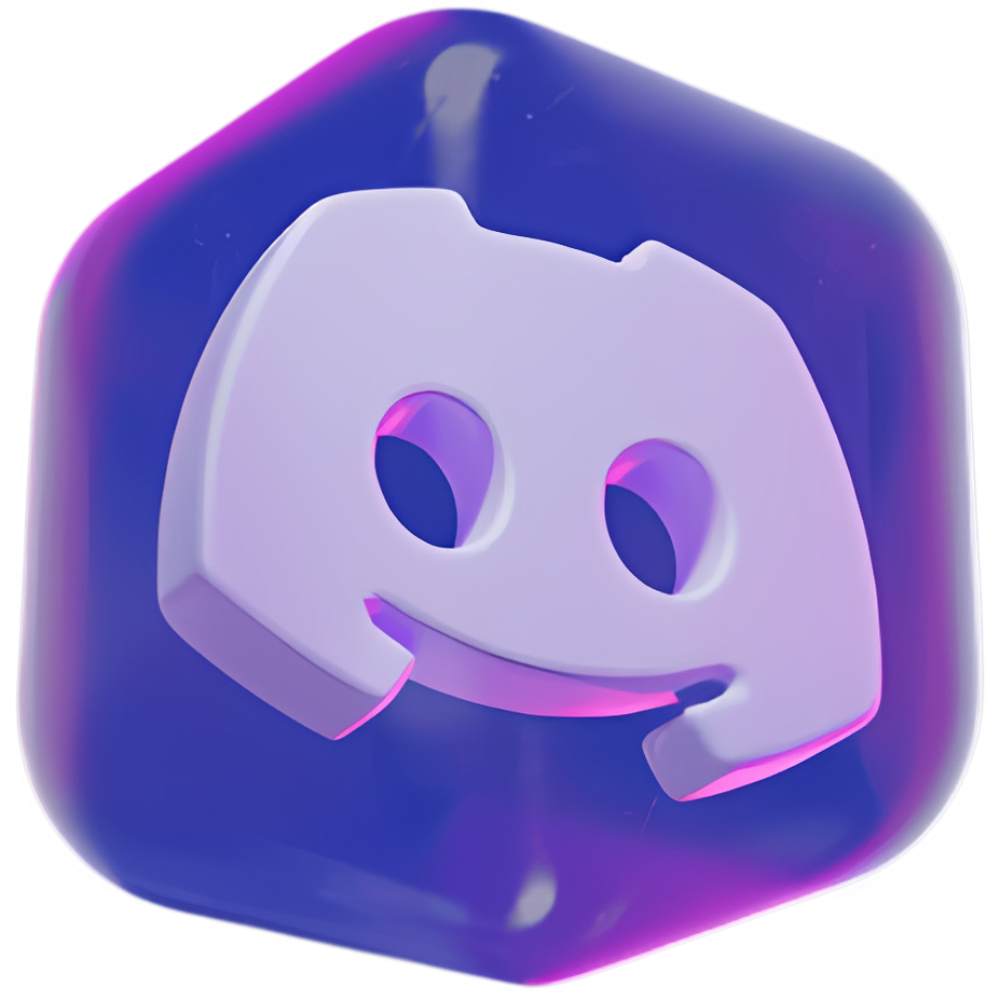

# Discord MCP for Codex



Discord MCP is a local Codex plugin that exposes a Discord bot as MCP tools. Codex starts the bridge when needed; no always-running gateway service or public server is required.

> [!IMPORTANT]
> This project is not affiliated with or endorsed by Discord. Discord is a
> trademark of Discord Inc. Use the bot only in servers where you are
> authorized to administer it.

## Requirements

- Codex desktop with local plugin support
- Node.js 18 or newer
- A Discord application with a bot user

## What it can do

- Check bot connectivity and generate an invite URL
- List accessible servers, channels, and roles
- Create, edit, and delete channels
- Send messages
- Create, edit, and delete roles
- Add and remove member roles
- Call any guild-scoped Discord API v10 JSON endpoint through guarded read/write fallback tools

The fallback layer covers moderation, bans, timeouts, AutoMod, threads, reactions, emojis, stickers, scheduled events, onboarding, soundboard, permissions, bot-managed webhooks, and new guild-scoped REST endpoints without waiting for a plugin update.

Discord still enforces the bot's permissions, enabled intents, and role hierarchy. Destructive tools require a target-specific confirmation token. Every generic write is previewed and requires a request-bound confirmation token before execution.

## Setup

1. In the [Discord Developer Portal](https://discord.com/developers/applications), create an application and add a bot.
2. Reset/copy the bot token. Never paste it into chat or save it in this plugin folder.
3. Run PowerShell and execute:

   ```powershell
   & "$HOME\plugins\discord-mcp\scripts\configure.ps1"
   ```

   The script securely prompts for the token and optionally for a comma-separated guild ID allowlist. It stores the values in your Windows user environment so Codex can forward them to the MCP process.
4. Restart the Codex desktop app after configuration.
5. Install/enable **Discord MCP** from the Personal marketplace, then start a new task.
6. Ask: "Check my Discord bot status and give me its Administrator invite URL."
7. Open the Administrator invite URL and authorize the bot for the intended server. The status result also includes a least-privilege alternative.

To find a guild ID, enable Developer Mode in Discord, right-click the server icon, and choose **Copy Server ID**. Supplying `DISCORD_ALLOWED_GUILD_IDS` is strongly recommended; the bridge rejects every guild outside that list.

## Install from source

1. Clone this repository into your local Codex plugins directory as
   `discord-mcp`.
2. Add the plugin to a local Codex marketplace or use the repository's plugin
   manifest with your existing local-plugin workflow.
3. Configure the bot credentials as described below.
4. Install or enable **Discord MCP**, restart Codex, and start a new task.

The plugin manifest is located at `.codex-plugin/plugin.json`, and the MCP
server definition is in `.mcp.json`.

## Configuration

- `DISCORD_BOT_TOKEN` (required): Discord bot token.
- `DISCORD_ALLOWED_GUILD_IDS` (recommended): comma-separated Discord guild IDs.

Run `scripts/configure.ps1 -Clear` to remove both user environment variables.

On macOS or Linux, set the same variables in the environment used to launch
Codex. For example:

```bash
export DISCORD_BOT_TOKEN='your-token'
export DISCORD_ALLOWED_GUILD_IDS='123456789012345678'
```

Do not put real values in a tracked file or paste them into a Codex task.

## Administrator access

`discord_status` now returns:

- `administrator_invite_url`, which requests Discord's `ADMINISTRATOR` permission bit (`8`)
- `least_privilege_invite_url`, which requests only the plugin's common management permissions
- `invite_url`, which points to the Administrator invite for convenience

For a bot already in the server, reauthorize it with `administrator_invite_url` or enable **Administrator** on its bot role in **Server Settings → Roles**. Move the bot role above every role it needs to manage. Administrator bypasses channel permission overwrites, but it does not bypass role hierarchy and cannot act on the server owner.

## Architecture

Codex communicates with a dependency-free local Node.js MCP server over stdio. The MCP server calls Discord API v10 over HTTPS using the bot token. It does not listen on a network port, receive Discord messages, or require privileged gateway intents.

## Coverage and limits

The guarded fallback tools support guild-scoped JSON REST endpoints using GET, POST, PUT, PATCH, and DELETE. They resolve guild ownership from guild, channel, stage, invite, or bot-authenticated webhook routes before making a request.

This on-demand local bridge does not implement Discord Gateway event listeners, persistent presence, voice/audio streaming, interaction callbacks that require temporary tokens, OAuth user flows, webhook-token execution routes, or multipart file uploads. Those features require a separate continuously running bot runtime or a purpose-built upload flow. Credential-bearing routes and JSON fields are deliberately blocked.

## Security notes

- Administrator is extremely powerful. Use it only in servers you control, keep the guild allowlist enabled, and protect the bot token like a password.
- Keep the allowlist enabled.
- Discord audit-log reasons are sent for supported administrative changes.
- Raw writes are bound to their method, path, query, body, and audit reason; changing any of them invalidates the confirmation token.
- Credential-like fields are blocked in request bodies and recursively redacted from raw API responses.
- Rotate the bot token immediately in the Developer Portal if it is ever exposed.

See [SECURITY.md](./SECURITY.md) for private vulnerability-reporting guidance.

## Development

The MCP server has no runtime package dependencies. Run the local checks and
protocol smoke test with:

```bash
npm test
```

The smoke test uses a placeholder token and does not call Discord. Pull
requests are also checked by GitHub Actions. See [CONTRIBUTING.md](./CONTRIBUTING.md)
for contribution guidelines and [CHANGELOG.md](./CHANGELOG.md) for release
history.

## License

The source code is available under the [MIT License](./LICENSE). Third-party
names, logos, and trademarks remain the property of their respective owners.
